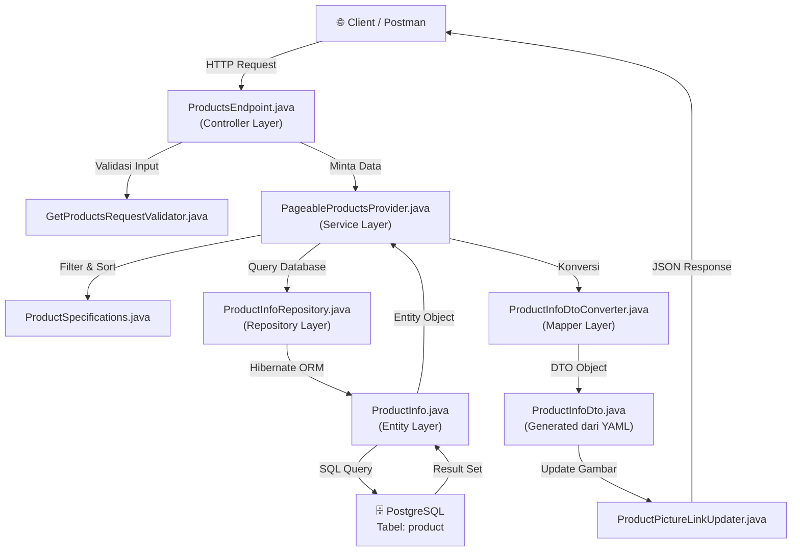

# 🎯 Level 1: Product Deep-Dive — Master Plan

> **Tujuan:** Menguasai satu fitur backend Spring Boot secara menyeluruh, dari ujung ke ujung, melalui modul **Product** di proyek Iced-Latte.

> [!IMPORTANT]
> Semua eksperimen dilakukan di branch `playground/latihan-pribadi`. Jangan pernah push ke `development` atau `main`.

---

## 📐 Arsitektur Modul Product (Peta Lengkap)

Berikut adalah alur data saat user meng-hit `GET /api/v1/products`:

### Layer-by-Layer (File yang Akan Kita Bedah)

| # | Layer | File | Fungsi |
|---|-------|------|--------|
| 1 | **Controller** | `ProductsEndpoint.java` | Menerima HTTP request, memanggil service |
| 2 | **Validator** | `GetProductsRequestValidator.java` | Validasi input (page, sort, dll) |
| 3 | **Service** | `PageableProductsProvider.java` | Logika bisnis, pagination, sorting |
| 4 | **Service** | `SingleProductProvider.java` | Ambil 1 produk + caching |
| 5 | **Specification** | `ProductSpecifications.java` | Dynamic query (filter harga, brand, dll) |
| 6 | **Repository** | `ProductInfoRepository.java` | Interface ke database (JPA + Native SQL) |
| 7 | **Entity** | `ProductInfo.java` | Representasi tabel `product` di Java |
| 8 | **Converter** | `ProductInfoDtoConverter.java` | Jembatan Entity ↔ DTO (MapStruct) |
| 9 | **Exception** | `ProductExceptionHandler.java` | Penanganan error khusus Product |
| 10 | **File Storage** | `ProductPictureLinkUpdater.java` | Menambah URL gambar dari MinIO |

---

## 🗓️ Rencana Sesi (5 Fase)

### Fase 1: Bedah Anatomi (Read-Only) 🔬
**Tujuan:** Memahami alur data dari request masuk sampai JSON keluar.

**Kegiatan:**
- [ ] Buka `ProductsEndpoint.java` → Pelajari bagaimana `@Override` meng-implement interface dari YAML
- [ ] Buka `SingleProductProvider.java` → Pelajari `@Transactional`, `@Cacheable`
- [ ] Buka `ProductInfo.java` → Pelajari anotasi JPA (`@Entity`, `@Column`, `@Id`, `@Version`)
- [ ] Buka `ProductInfoDtoConverter.java` → Pelajari MapStruct (`@Mapper`, `@Mapping`, `@Named`)
- [ ] Buka `ProductSpecifications.java` → Pelajari JPA Criteria API (dynamic filtering)
- [ ] Jalankan `GET /api/v1/products?min_price=5&brand_names=Starbucks` di Swagger → Lihat hasilnya terfilter

**Konsep yang Dipelajari:**
- Dependency Injection (`@RequiredArgsConstructor`)
- Layered Architecture (Controller → Service → Repository → Entity)
- Spring Data JPA (Repository pattern)
- Caching (`@Cacheable`)
- Transaction Management (`@Transactional`)

---

### Fase 2: Merusak dengan Sengaja (Break & Learn) 💣
**Tujuan:** Memahami *kenapa* setiap bagian penting dengan cara merusaknya.

**Eksperimen:**
- [ ] Hapus `@Transactional` di `SingleProductProvider` → Apa yang terjadi?
- [ ] Ubah `@Cacheable` key → Apa dampaknya terhadap performa?
- [ ] Hapus satu `@Column` di `ProductInfo.java` → Error apa yang muncul?
- [ ] Masukkan data dengan `price = -1` via SQL → Apa yang menghentikannya?
- [ ] Ubah nama kolom di `@Column(name = "xxx")` → Lihat error Hibernate

**Konsep yang Dipelajari:**
- Memahami konsekuensi setiap anotasi
- Debugging Hibernate/JPA errors
- Pentingnya constraint di level database vs aplikasi

---

### Fase 3: Modifikasi Fitur yang Ada (Edit Existing) 🔧
**Tujuan:** Mulai mengubah kode yang sudah berjalan.

**Tugas:**
- [ ] Tambahkan filter baru: `origin_country` di endpoint `GET /api/v1/products`
  - Edit `ProductsEndpoint.java` → tambah `@RequestParam`
  - Edit `ProductSpecifications.java` → tambah method baru `originCountrySpec()`
  - Edit `PageableProductsProvider.java` → gunakan spec baru
  - Tes di Swagger: `GET /api/v1/products?origin_country=Italy`
- [ ] Ubah default sorting dari `name` ke `price` (cari di `PaginationConfig`)
- [ ] Tambahkan pesan log baru di endpoint `getProductById`

**Konsep yang Dipelajari:**
- Cara menambah parameter tanpa merusak backward compatibility
- JPA Specification pattern (dynamic where clause)
- Konfigurasi Spring Boot via YAML

---

### Fase 4: Bikin Fitur Baru dari Nol (Create New Feature) 🚀
**Tujuan:** Membuktikan bahwa kamu bisa membuat fitur backend sendiri secara *end-to-end*.

**Misi Besar: Menambahkan Fitur "Product Category"**

Saat ini produk di Iced-Latte tidak punya kategori (Coffee, Tea, Chocolate, dll). Kita akan menambahkannya!

**Langkah-langkah:**
- [ ] **Database:** Buat file SQL migration baru (Liquibase) untuk menambah kolom `category` di tabel `product`
- [ ] **Entity:** Tambahkan field `category` di `ProductInfo.java`
- [ ] **YAML:** Tambahkan property `category` di `product-openapi.yaml` (agar DTO ter-generate)
- [ ] **Converter:** Pastikan MapStruct bisa mapping field baru
- [ ] **Filter:** Buat `ProductSpecifications.categorySpec()` untuk filtering by category
- [ ] **Endpoint:** Tambahkan `@RequestParam category` di `getProducts()`
- [ ] **Seed Data:** Update SQL insert agar produk punya kategori
- [ ] **Tes:** Hit `GET /api/v1/products?category=Coffee` di Swagger

**Konsep yang Dipelajari:**
- Full-stack backend development cycle
- Database migration (Liquibase)
- Backward-compatible API changes
- End-to-end testing

---

### Fase 5: Exception Handling & Validasi (Hardening) 🛡️
**Tujuan:** Membuat API-mu tahan banting dari input yang salah.

**Tugas:**
- [ ] Pelajari `ProductExceptionHandler.java` → Bagaimana error ditangkap dan diformat
- [ ] Pelajari `ApiErrorResponseCreator.java` → Format error response standar
- [ ] Buat exception baru: `InvalidCategoryException` (jika user mengirim kategori yang tidak ada)
- [ ] Tambahkan validasi di `GetProductsRequestValidator.java`
- [ ] Tes dengan mengirim request yang salah dan lihat format error-nya

**Konsep yang Dipelajari:**
- `@RestControllerAdvice` dan `@ExceptionHandler`
- Custom Exception classes
- Input validation pattern
- Error response standardization

---

## 🏆 Milestone Kelulusan Level 1

Setelah menyelesaikan semua fase di atas, kamu akan mampu:
1. ✅ Membaca dan memahami kode Spring Boot proyek manapun
2. ✅ Menambah endpoint API baru dengan filter & pagination
3. ✅ Membuat database migration
4. ✅ Menghubungkan Entity ↔ DTO dengan MapStruct
5. ✅ Menangani error dengan elegan
6. ✅ Menulis kode yang siap di-review oleh Senior Developer

**Setelah Level 1 selesai, kita lanjut ke Level 2: Security & Auth!** 🔐
